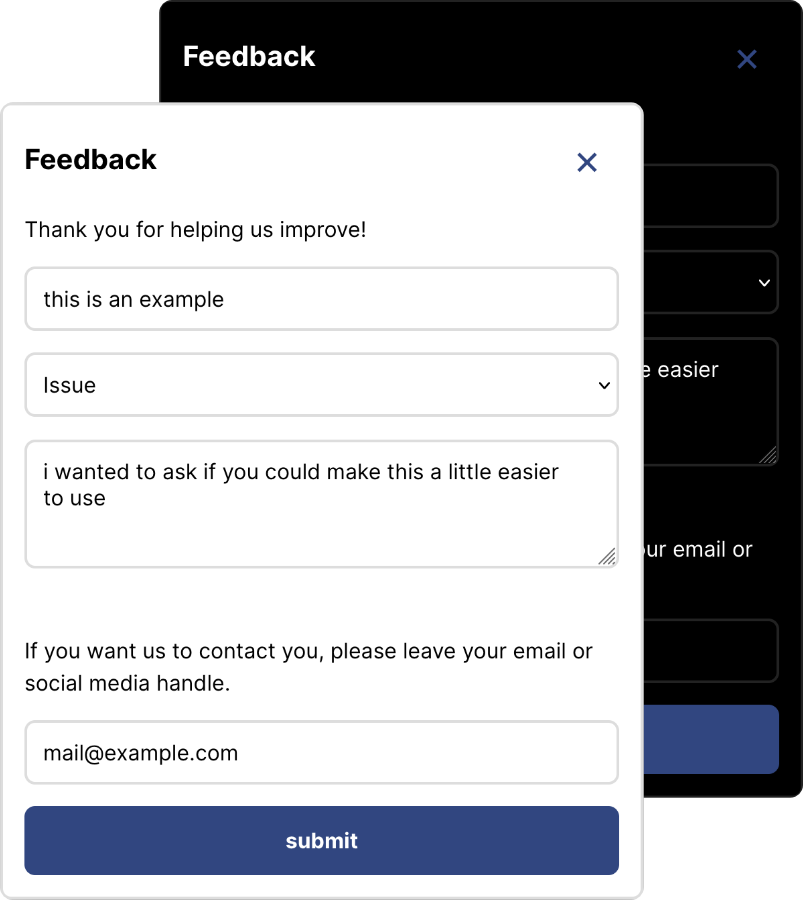

<br>

# **mœwe** | typescript client

moewe _(german for seagull 🐣)_ is a open source, privacy preserving crash logging and config platform that can be self-hosted.

## motivation

During foss development, I always wished there was a simple platform for crash reporting and knowing roughly how many people are using the software. mœwe aims to be exactly this without the privacy concerns of the large analytics solutions. I hope this is useful to you.

_yours, Robin_

find more information at [moewe.app](https://moewe.app)

## features

- crash logging
- event logging
- user feedback collection
- live config via feature flags
- includes simple UI components for simple integration
  - compatible with React, Angular, Vue, Svelte and more
- let users know about new app versions



## usage

initialize the client within your Flutter applications `main.dart`

```ts
// setup Moewe
await new moewe.Moewe({
  host: "open.moewe.app",
  project: "projectId",
  app: "appId",
}).init();

render(...)
```

That's it 🎉

you can now use the `moewe()` client within your app:

```ts
moewe().events.appOpen({});
moewe().log.debug("this is a debug message");
moewe().crash("an error occurred", null);

// report user feedback
moewe().ui.showFeedbackDialog(); // using package UI
moewe().feedback(...) // manually

// get flag value from server
moewe().config.flagString("fav_food");
```

### feature flags

mœwe allows your client to access variables defined on the server. This makes it possible to:

- let users know whether a new version of your application is available for them
- toggle specific (maybe experimental) features on and off
- do A/B testing

you can access these flags with the following function.
Make sure to await the moewe `init()` call before using feature flags. Otherwise all flags are `null`

```
moewe().config.flagString("abc");
moewe().config.flagInt("def");
moewe().config.flagBool("ghi");
```

### crash logging

You can log crashes using the `moewe.crash(...)` function. You can also use this for wrapping your application
